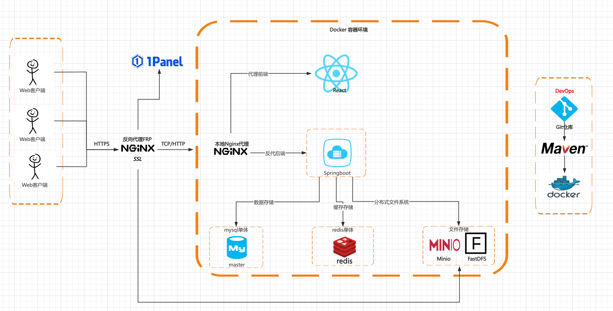

# WatchTogetherReact 

## React + Typescript + Tailwindcss

[后端地址](https://github.com/Kamisorara/WatchTogetherBackend)

## 项目运行

```bash
# 依赖安装
npm install

# 项目启动
npm run dev

# 打包
npm run dev
```

### 系统架构图
